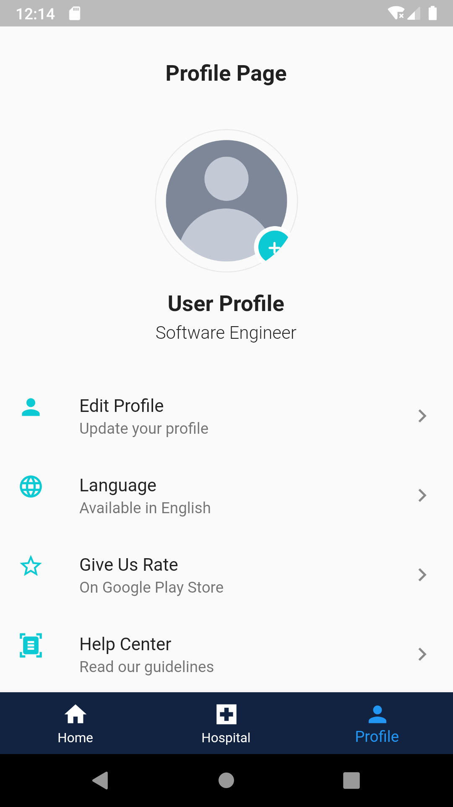
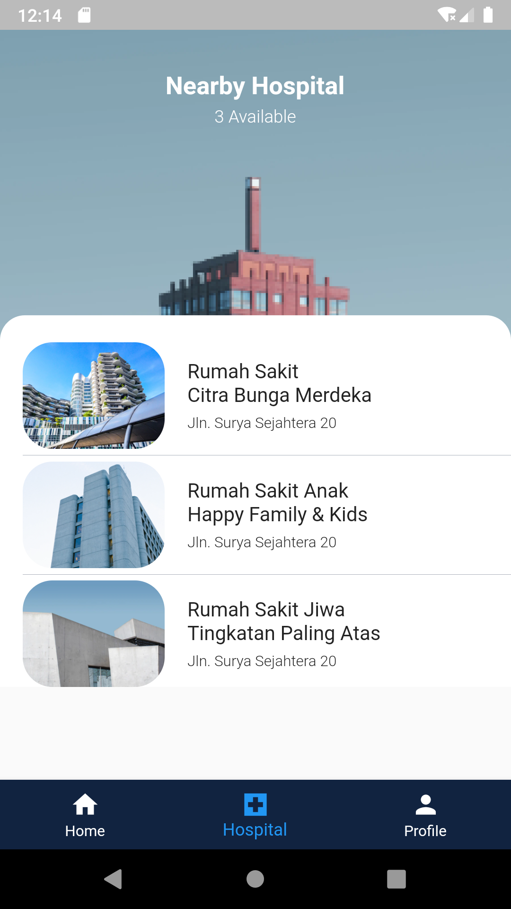
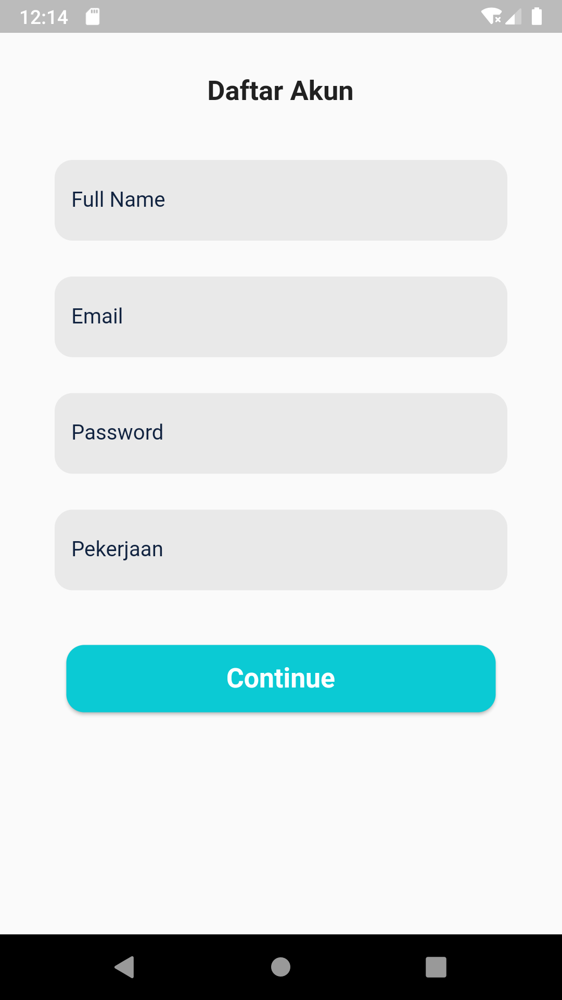
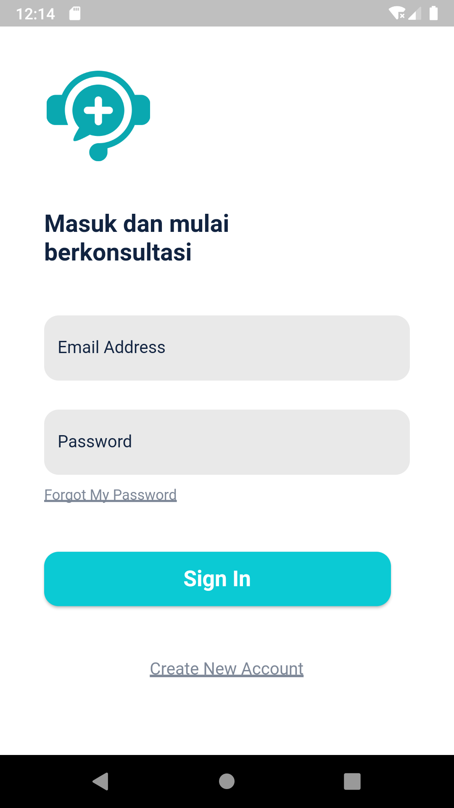

# FLUTTER UI : Job Application

### Description
Slicing UI from Figma, My Doctor App.

### Features
- Upload Image from Camera

### Package
- google_fonts
- responsive_framework

### Tech Used
 

## Screenshots

  |  | |

 
  |  | |

